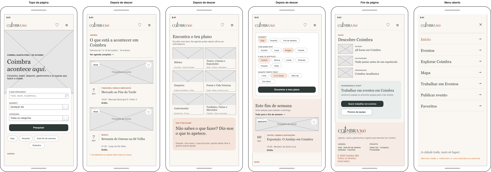
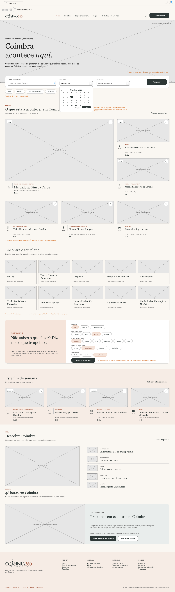
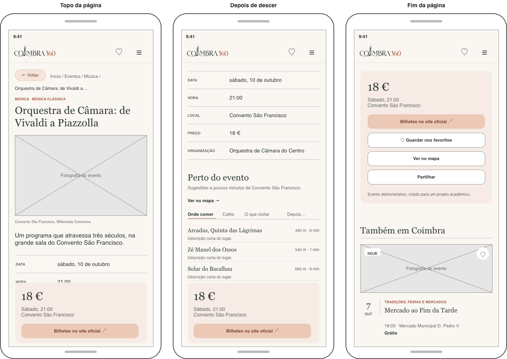
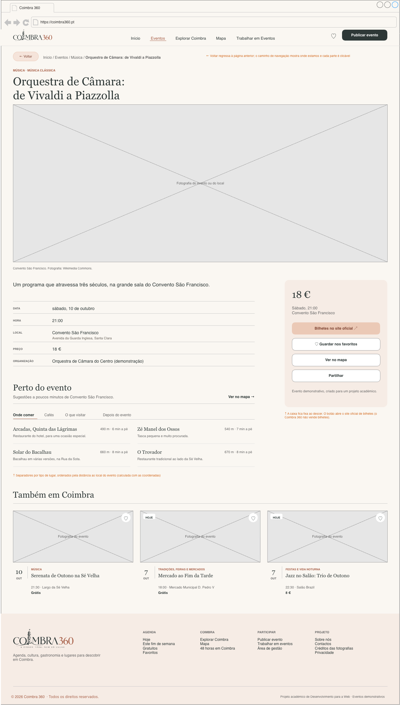

# Coimbra 360

_Website_ que reúne num só lugar os eventos, a cultura e os lugares a descobrir em Coimbra.

Projeto da unidade curricular **Desenvolvimento para a Web**, da Licenciatura em Ciência de Dados para a Gestão (Coimbra Business School | ISCAC), ano letivo 2026/2027.

## Grupo

| Nº | Nome |
|---|---|
| 2024131057 | Luna Ferreira |
| 2024131564 | Matilde Gomes |

## Projeto

O Coimbra 360 é uma plataforma que reúne num só lugar os eventos, a cultura e os lugares a descobrir em Coimbra. 
Permite pesquisar eventos por data ou categoria, ver o local, horário e preço, quando aplicável aceder ao _link_ oficial de bilhetes e encontrar sugestões perto de cada evento. 
Inclui ainda guias da cidade, um mapa, um planeador de programas e uma área para organizadores publicarem eventos e pedirem staff para eventos.

## Estrutura do _website_

O menu aparece em todas as páginas, com o botão Publicar evento sempre em destaque. 
No telemóvel, o menu abre a partir do botão de menu. 
O rodapé, igual em todas as páginas, dando acesso às restantes páginas.

```
Menu: Início | Eventos | Explorar Coimbra | Mapa | Trabalhar em Eventos | Favoritos | Publicar evento

Início ........................ pesquisa com calendário, agenda em destaque,
│                               categorias, "Faz o teu plano", fim de semana e guias
├── Eventos ................... agenda por dia, com pesquisa e filtros
│   └── Detalhe do evento ..... foto, descrição, local, preço, bilhetes
│                               e sugestões "Perto do evento"
├── Explorar Coimbra .......... guias da cidade e lugares a visitar
│   └── Guia .................. roteiro com os lugares recomendados
├── Mapa ...................... eventos e lugares de interesse, com filtros,
│                               para ver o que há à volta de cada evento
├── Trabalhar em Eventos ...... oportunidades, candidatura e pedido de equipa
├── Favoritos ................. eventos guardados pelo utilizador
├── Publicar evento ........... formulário de submissão para aprovação
└── Rodapé
    ├── Sobre nós ............. o projeto, perfis de utilizador e créditos
    ├── Contactos ............. formulário de contacto
    ├── Área de gestão ........ aprovar ou rejeitar pedidos e ver mensagens
    └── Privacidade ........... dados guardados no navegador
```

## Funcionalidades

### Básicas

- Agenda de eventos, por ordem cronológica e agrupada por dia
- Pesquisa por palavra-chave, data e categoria, com calendário no "Quando?" e atalhos (hoje, amanhã, fim de semana, gratuitos)
- Página de cada evento com foto, descrição, data, hora, local, preço, organizador e ligação para os bilhetes no site oficial
- "Perto do evento": onde comer, cafés, o que visitar e o que fazer depois, ordenados por distância
- Categorias e subcategorias de eventos
- "Faz o teu plano": sugestão de programa a partir das preferências do utilizador
- Mapa interativo com eventos e pontos de interesse
- Guias "Explorar Coimbra"
- Favoritos guardados no navegador e botão para partilhar o evento
- Formulário "Publicar evento", com validação e estado "pendente de aprovação"
- Área "Trabalhar em Eventos": oportunidades, candidatura e pedido de equipa
- Área de gestão para aprovar ou rejeitar pedidos
- Formulário de contactos
- Navegação com menu, botão Voltar e caminho de navegação, com o site adaptado a computador e telemóvel
- Acessibilidade (descrições nas imagens, navegação por teclado, formulários legíveis por leitores de ecrã)

### Extras

- Adicionar um evento ao calendário do telemóvel (Google Calendar, Apple)
- Modo escuro
- Filtro por preço máximo na agenda
- Avaliações dos eventos e dos lugares pelos utilizadores, guardadas no navegador
- Versão em inglês (PT | EN)

## Esquemas

Os esquemas foram feitos no [draw.io](https://app.diagrams.net) com a biblioteca de formas Mockups. O ficheiro original está em [`mockups/coimbra-360.drawio`](mockups/coimbra-360.drawio) e tem um separador para cada esquema: a página inicial e a página de um evento, cada uma em telemóvel e em computador. Na mesma pasta está a exportação de cada separador em imagem.

No telemóvel, cada página aparece em vários ecrãs, pela ordem em que se desce: a página inicial vai do topo até ao rodapé e termina com o menu aberto, e a página do evento mostra o topo, a informação e o fim da página. As fotografias aparecem como espaços reservados e as notas a laranja explicam o que fazem alguns elementos.

### Página inicial: _Mobile_



### Página inicial: _Desktop_



### Evento: _Mobile_



### Evento: _Desktop_



## Referencias

_Websites_ que serviram de referência e o que se aproveitou de cada um.

_Website_:

## Referências

Websites que serviram de referência e o que se aproveitou de cada um:

- [Airbnb](https://www.airbnb.pt/): pesquisa numa só barra com vários campos e cartões grandes com fotografia.
- [Time Out Portugal](https://www.timeout.pt/): agenda organizada por dias e secções de "o que fazer" com destaques.
- [Eventbrite](https://www.eventbrite.pt/): página de evento com a informação prática e caixa de bilhetes com o botão de compra sempre visível.
- [Google Maps](https://www.google.com/maps): mapa com pontos de interesse e distâncias a pé, usado no Mapa e em "Perto do evento".
- [Visit Lisboa](https://www.visitlisboa.com/): guias da cidade e sugestões de lugares a visitar, base para Explorar Coimbra.
- [Indeed](https://pt.indeed.com/): lista de oportunidades e formulário de candidatura, base para Trabalhar em Eventos.
- [Coimbragenda](https://www.coimbragenda.pt/): agenda de eventos de Coimbra e organização por datas e categorias.
- [TAGV](https://tagv.pt/): programação de espetáculos e apresentação da informação de cada sessão.
